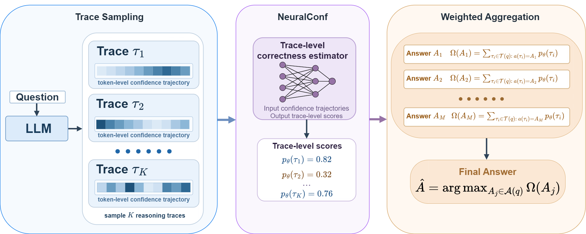

# NeuralConf

Official implementation of **Confidence Geometry Reveals Trace-Level Correctness in Large Language Model Reasoning**.



NeuralConf estimates whether a sampled reasoning trace will produce the correct final answer from its token-level confidence trajectory. The model uses only a one-dimensional confidence sequence and a trace-level correctness label. It does not use the reasoning text, hidden states, external verifiers, retrieval results, or task-specific auxiliary features.

## Repository Overview

This repository contains the code needed to:

1. generate sampled reasoning traces with token-level confidence trajectories;
2. train NeuralConf to predict trace-level final-answer correctness;
3. evaluate trace-level discrimination and answer-level aggregation;
4. export scalar metrics and aggregation tables for paper analysis.

## Installation

```bash
conda create -n neuralconf python=3.10 -y
conda activate neuralconf
pip install -e .
```

If you prefer installing from the requirements file first:

```bash
pip install -r requirements.txt
pip install -e .
```

Run a minimal import check:

```bash
python -c "from neuralconf.evaluator import math_equal; print(math_equal('42', '42'))"
```

## Repository Structure

```text
neuralconf/
  data.py          # JSONL loading, trace preprocessing, dataset and collation
  evaluator.py     # answer normalization and mathematical equivalence checks
  io.py            # checkpoint loading helpers
  losses.py        # weighted BCE and optional pairwise ranking loss
  metrics.py       # trace-level and answer-level evaluation helpers
  model.py         # ResNet1D-based NeuralConf architecture
  voting.py        # majority vote and confidence-weighted aggregation baselines
scripts/
  generate_traces_openai.py
  train_neuralconf.py
  evaluate_neuralconf.py
examples/
  sample_traces.jsonl
assets/
  Neuralconf.png
README.md
requirements.txt
pyproject.toml
LICENSE
```

## Data Format

Training, validation, and evaluation files are JSONL files. Each line corresponds to one sampled reasoning trace:

```json
{
  "qid": 17,
  "question": "...",
  "gold_answer": "...",
  "pred_answer": "...",
  "confidences": [7.31, 8.27, 6.22, 10.19],
  "trace_id": 0,
  "is_correct": 1
}
```

Required fields:

- `qid`: question identifier. All traces sampled for the same question must share the same `qid`.
- `pred_answer`: final answer extracted from the sampled reasoning trace.
- `confidences`: token-level confidence trajectory for the trace.
- `is_correct`, or both `gold_answer` and `pred_answer`. If `is_correct` is absent, the loader computes it with `math_equal(pred_answer, gold_answer)`.

Recommended fields:

- `question`: original question or prompt text. NeuralConf does not consume this field, but it is useful for auditing.
- `gold_answer`: ground-truth final answer. This is required for evaluation and for deriving `is_correct` when labels are not precomputed.
- `trace_id`: trace index within a question group.

The loader also accepts common alternative confidence keys: `confs`, `confidence`, `token_confidences`, and `token_level_confidences`.

### Splitting Protocol

For paper-style experiments, split by question id, not by trace:

- training split: traces from training questions only;
- validation split: traces from validation questions only;
- test split: traces from held-out test questions only.

Trace-level random splitting is not recommended because traces from the same question can appear in both training and evaluation.

## NeuralConf Input Construction

For each trace, `TraceDataset` constructs a fixed-length sequence of length `max_len`:

- if the trace has at least `max_len` confidence values, retain the final `max_len` values;
- if the trace is shorter, left-pad it with zeros;
- construct a binary mask so padded positions are excluded from masked average pooling.

This tail-aligned construction is the default setting used by the training and evaluation scripts. The model receives only the confidence trajectory and its mask.

## Generating Traces

If trace JSONL files are already available, this step can be skipped. Otherwise, use `scripts/generate_traces_openai.py` with an OpenAI-compatible completions endpoint that returns token log probabilities.

Input examples should be stored as JSONL. A minimal input line is:

```json
{"qid": 17, "question": "...", "answer": "..."}
```

The script asks the model to put the final answer inside `\boxed{}`. The boxed content is extracted as `pred_answer`.

```bash
python scripts/generate_traces_openai.py \
  --input-jsonl data/questions.jsonl \
  --output-jsonl data/traces.jsonl \
  --model deepseek-r1-distill-qwen-1.5b \
  --base-url http://localhost:8000/v1 \
  --api-key EMPTY \
  --total-budget 128 \
  --temperature 1.0 \
  --top-p 1.0 \
  --logprobs 20 \
  --max-tokens 20000 \
  --overwrite
```

The output contains one line per retained trace:

```json
{
  "qid": 17,
  "question": "...",
  "gold_answer": "...",
  "pred_answer": "...",
  "confidences": [0.31, 0.27, 0.22, 0.19],
  "trace_id": 0,
  "gen_time": 2.41,
  "is_correct": 1
}
```

Use `--save-completion` only when the full generated reasoning text is needed for auditing. NeuralConf itself never consumes the completion text.

## Training

Train one model for a single dataset, seed, and maximum sequence length:

```bash
python scripts/train_neuralconf.py \
  --dataset-name GSM8K \
  --train-jsonl data/gsm8k_train.jsonl \
  --val-jsonl data/gsm8k_val.jsonl \
  --out-dir outputs/train/gsm8k_maxlen2048 \
  --max-len 2048 \
  --seed 42 \
  --epochs 25 \
  --batch-size 512 \
  --lr 5e-6 \
  --rank-weight 0.0
```

The default architecture is the paper model: a token-only ResNet1D encoder with one input channel, `d_model=128`, masked average pooling, and an MLP correctness head.

Training outputs:

- `*_best.pt`: checkpoint selected by validation trace-level AUC;
- `*_final.pt`: final checkpoint after the last epoch;
- `*_history.csv`: epoch-level training and validation metrics;
- `*_summary.json`: run configuration, class weights, and checkpoint paths.

## Evaluation

Evaluate a trained checkpoint on a held-out trace JSONL file:

```bash
python scripts/evaluate_neuralconf.py \
  --mode standard \
  --dataset-name GSM8K \
  --eval-jsonl data/gsm8k_test.jsonl \
  --ckpt outputs/train/gsm8k_maxlen2048/GSM8K_maxlen2048_seed42_best.pt \
  --out-dir outputs/eval/gsm8k_maxlen2048 \
  --metrics-csv outputs/eval/all_metrics.csv \
  --max-len 2048 \
  --alignment tail
```

The standard evaluation reports:

- `neural_auc`: trace-level ROC-AUC of NeuralConf;
- `tail_auc`: trace-level ROC-AUC of the TailConf baseline;
- `bottom10_auc`: trace-level ROC-AUC of the Bottom-10Conf baseline, computed from the raw full confidence trajectory;
- `trace_acc_at_0.5`: trace correctness accuracy from thresholding NeuralConf at 0.5;
- `brier`: Brier score for calibrated trace correctness probabilities;
- `neural_dbi` and, when requested, `raw_input_dbi`;
- majority-vote accuracy and confidence-weighted aggregation accuracy for TailConf, Bottom-10Conf, and NeuralConf.

Evaluation outputs:

- `*_eval_summary.json`: scalar metrics and paths to derived files;
- `*_aggregation_table.csv`: answer-level aggregation results;
- `all_metrics.csv`: appended metrics across evaluation runs when `--metrics-csv` is provided.

Per-trace scores are not saved by default. To export them, add:

```bash
--save-trace-scores
```

## Maximum-Length Experiments

To evaluate different input lengths, train and evaluate one checkpoint per length. The scripts do not perform automatic checkpoint discovery.

```bash
for L in 4 8 16 32 64 128 256 512 1024 2048; do
  python scripts/train_neuralconf.py \
    --dataset-name GSM8K \
    --train-jsonl data/gsm8k_train.jsonl \
    --val-jsonl data/gsm8k_val.jsonl \
    --out-dir outputs/train/gsm8k_maxlen${L} \
    --max-len ${L} \
    --seed 42 \
    --epochs 25 \
    --batch-size 512 \
    --lr 5e-6

  python scripts/evaluate_neuralconf.py \
    --mode standard \
    --dataset-name GSM8K \
    --eval-jsonl data/gsm8k_test.jsonl \
    --ckpt outputs/train/gsm8k_maxlen${L}/GSM8K_maxlen${L}_seed42_best.pt \
    --out-dir outputs/eval/gsm8k_maxlen${L} \
    --metrics-csv outputs/eval/all_metrics.csv \
    --max-len ${L}
done
```

## Confidence Baselines

TailConf is computed as the mean confidence over the final `max_len` positions of the raw trajectory. Bottom-10Conf is computed from the raw full confidence trajectory using grouped confidence windows. By default, traces shorter than the grouping length use their full available trajectory as one effective group. These baselines are implemented in `neuralconf/voting.py` and are evaluated alongside NeuralConf for trace-level scoring and answer-level aggregation.

## Citation

```bibtex
@article{liu2026neuralconf,
  title  = {Confidence Geometry Reveals Trace-Level Correctness in Large Language Model Reasoning},
  author = {Liu, Shuo and Liu, Ding and Ran, Shi-Ju},
  year   = {2026}
}
```

## License

This project is released under the MIT License. See [LICENSE](LICENSE).
